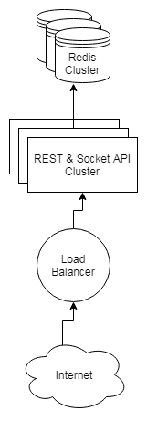
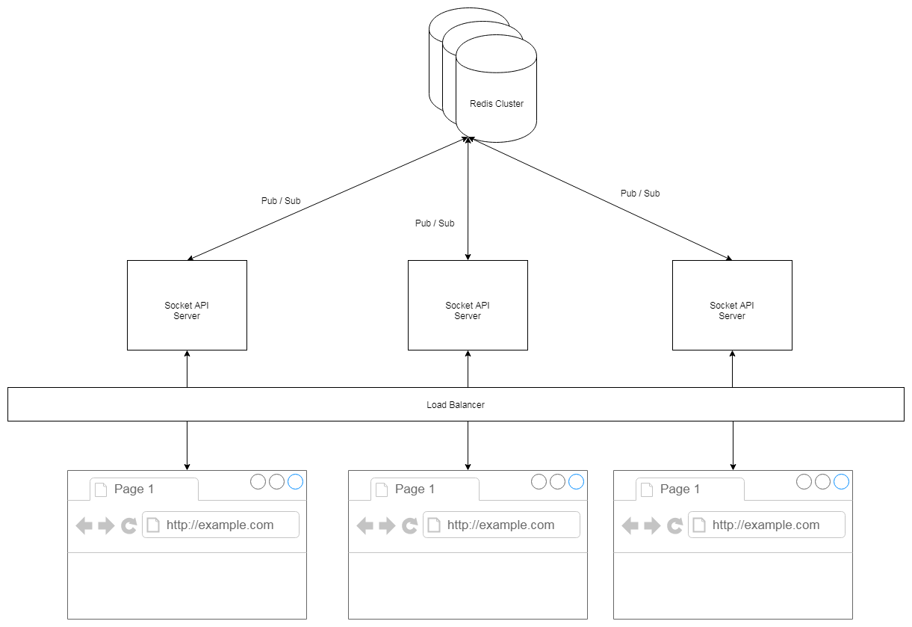

# Voting System

This project contains a RESTful API for Creating and Reading Campaigns and Votes, and a socket API for getting the realtime Votes of the subscribed Campaigns.

RESTful API doc is in [**_apidoc/index.html_**](./apidoc/index.html) and the POSTMAN collectin data is in [**_VotingSystem.postman_collection.json_**](./VotingSystem.postman_collection.json). Socket API doc is in [**_SocketAPI.md_**](./SocketAPI.md).

---

## Enviroment

- NodeJs 8.9 +
- Redis 4.0 +
- MySQL 5.7.21 +
- docker-compose 1.22.0 +

---

## Setup and Start the server for Development

The docker setup version includes redis and mysql. There is no need to edit the config.

The manual setup version needs to prepare redis, mysql yourself and edit the config according to your redis & mysql info.

### by Docker

Setup details can be found in [**_docker-compose.yml_**](./docker-compose.yml).

```sh
docker-compose up -d
```

Use this command to see the logs:
```sh
docker logs --tail 50 --follow --timestamps voting_api-service_1
```

The last line of the log maybe like this:
```text
wait-for-it.sh: waiting for mysql-service:3306 without a timeout
```

It needs time to wait for MySQL ready. Just wait until this line occurs:
```text
Koa API is starting at port 3000
```

And this command can be used to get into the container:
```sh
docker exec -it voting_api-service_1 /bin/bash
```

ATTENTION: [**_wait-for-it.sh_**](./wait-for-it.sh) maybe corrupted if you clone the repo on a Window System and upload it to a Linux System. Download the zip version from [the original github repo](https://github.com/vishnubob/wait-for-it) is saver.

### Manually

Install dependencies:

```sh
npm i --no-save
npm i sequelize-cli -g
```

Edit the database config in [**_config/dev.js_**](./config/dev.js):

```js
// ...
  DB: {
    REDIS: {
      host: "YOUR_REDIS_HOST",
      password: "PASSWORD",
      // ...
    },
    MYSQL: {
      username: "USER",
      password: "PASSWORD",
      host: "YOUR_MYSQL_HOST",
      // ...
    },
  },
// ...
```

Create MySQL schema:

```sh
sequelize-cli db:create
sequelize-cli db:migrate
```

Start the server

```sh
npm run start:dev
```

or

```sh
pm2 start ecosystem.config.js --env=dev
```

---

## Available APIs

```
GET http://localhost:3000/campaign
GET http://localhost:3000/campaign/:campaign_uuid
POST http://localhost:3000/campaign
GET http://localhost:3000/vote/:campaign_uuid
POST http://localhost:3000/vote/:campaign_uuid
GET http://localhost:3000/list
```

and Socket:

```
ws://localhost:3000
```

Details refer to [**_apidoc/index.html_**](./apidoc/index.html), [**_VotingSystem.postman_collection.json_**](./VotingSystem.postman_collection.json) and [**_SocketAPI.md_**](./SocketAPI.md).

---

## Update RESTful Doc

```sh
npm run apidoc
```

---

## VScode Debug setting

```json
{
  "version": "0.2.0",
  "configurations": [
    {
      "type": "node",
      "request": "attach",
      "name": "Local Debug",
      "protocol": "inspector",
      "address": "localhost",
      "port": 9229,
      "localRoot": "${workspaceFolder}",
      "remoteRoot": "${workspaceFolder}"
    },
    {
      "type": "node",
      "request": "attach",
      "name": "Container Debug",
      "protocol": "inspector",
      "address": "localhost",
      "port": 9229,
      "localRoot": "${workspaceFolder}",
      "remoteRoot": "/project"
    }
  ]
}
```

---

## Unit Test

Setup the test db:
```sh
sequelize-cli db:create --env test
sequelize-cli db:migrate --env test
```

then:
```sh
npm test
```

There is no automatic test case for the Socket API. A manual test is in [**_./test/socket.html_**](./test/socket.html).

---

## High Avalibility and Scalability

The RESTful Nodes are stateless so it can be Horizontally Scale up or down on demand. Also database sharding can be used to horizontal scale the Redis Cluster if necessary(The database connection code in [**_model/Redis/notification.js_**](./model/Redis/notification.js) and [**_model/Redis/notification.js_**](./model/Redis/notification.js), the API setting in [**_config/dev.js_**](./config/dev.js) and the redis database config need to be modified to enable the cluster mode).



The Publication and Subscription API of Redis are used to boardcast the voting event to every Socket Node and than emitting the Current Votes to clients via Socket.io. So the Socket Node Cluster is also horizontally scalable.



---

## Why Redis?

Redis is faster than most dbs and support data persistance, event boardcasting.
Voting sometimes may face temporary high IO, but not all the time.
Horizontal scaling is suitable in this case.
Redis Cluster supports data sharding, it means it can be horizontal scaling easily.

---

## Why use npm ioredis(but not npm redis)

ioredis unified the redis cluster feature better than the offical node redis library and promisified all methods by default.

---

## Redis DB structure draft

```
campaigns (zset)
  score: {end_time}
  value: {
    id => campaign_uuid(String)
    title => title(String)
    start_time => time(Unix)
    end_time => time(Unix)
    options => options(Set)
  }

campaigns:{campaign_uuid} (hash)
  id => campaign_uuid(String)
  title => title(String)
  start_time => time(Unix)
  end_time => time(Unix)
  options => options(Set)

options:campaign_uuid (set)
  option

votes:{campaign_uuid}:{option} (set)
  hkid_md5(String)

vote:{hkid_md5} (string)
  {campaign_uuid} => {option}
```

---

## Why Sets?

The action of adding set member is repeatable and easy for restoring data from request log.
